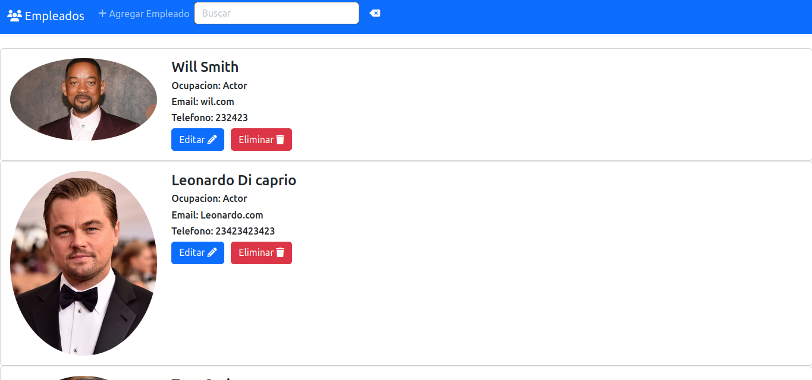
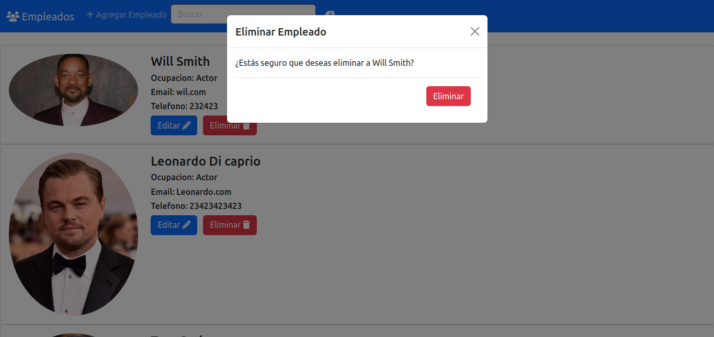
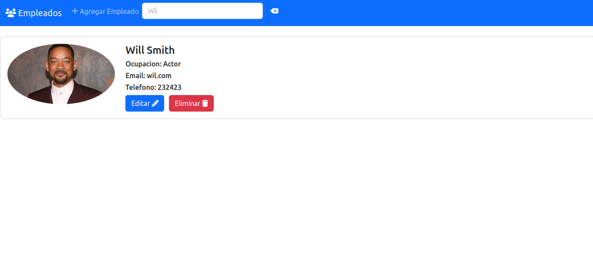
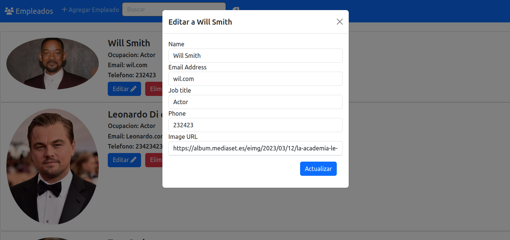
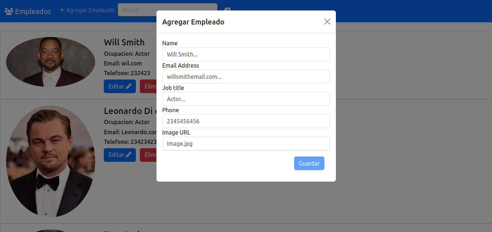
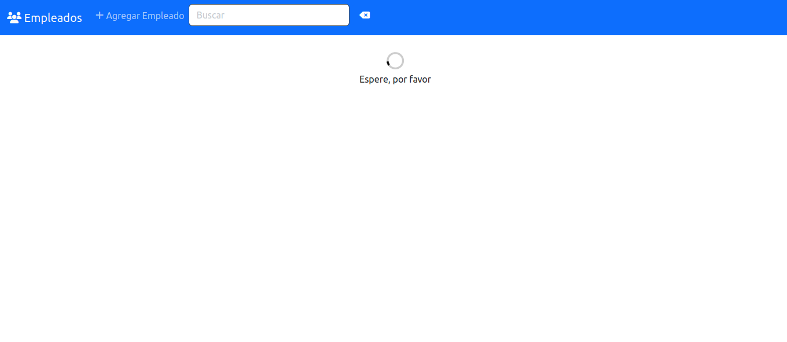

# AgendaAngular

Este proyecto es generado con [Angular CLI](https://github.com/angular/angular-cli) version 14.2.6.

## Development server

Para correr `ng serve -o` para ejecutar el servridor de desarrollo. Navega a `http://localhost:4200/` o solamente abrirá el navegador. Esta aplicación automáticamente recargara los cambios, por lo que no se tendrá que ejecutarse varias veces.

## Build

Corre `ng build` para construir el proyecto.

## Further help
To get more help on the Angular CLI use `ng help` or go check out the [Angular CLI Overview and Command Reference](https://angular.io/cli) page.

## Descripción del Proyecto
Es una aplicación que consume un microservicio en springboot, hace las operaciones básicas del crud utilizando la libreria rxjs con Httpclient, ademas se añadió cierto diseño con el framework de css(bootstrap). 
 
La aplicación del Backend se encuentra en el siguiente enlace. [Aqui]().

Imagénes del proyecto.
 

 

 

 

 

 

